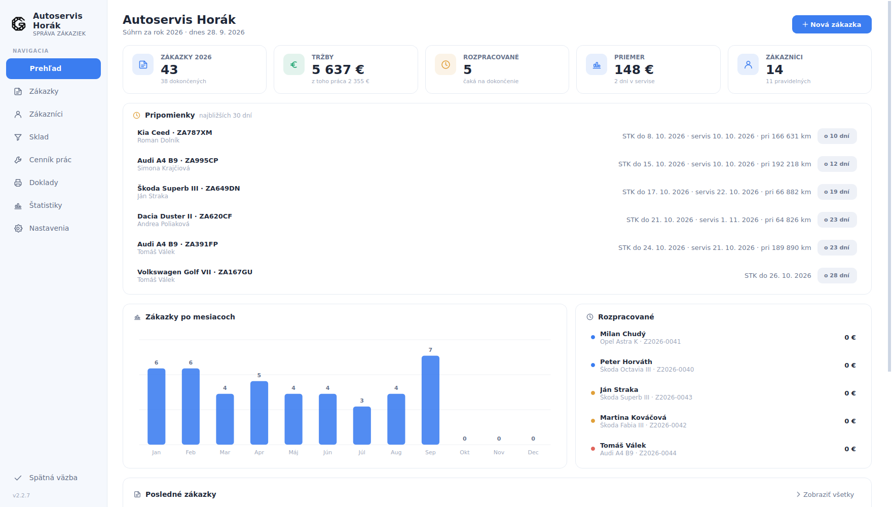
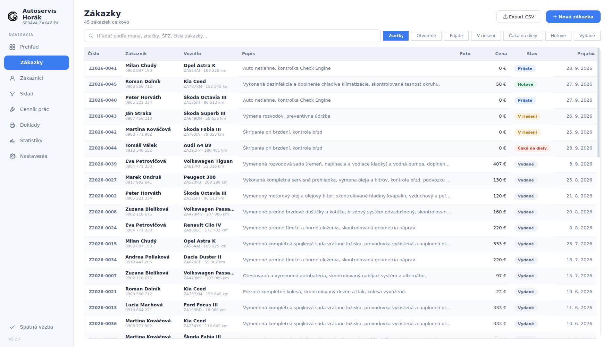
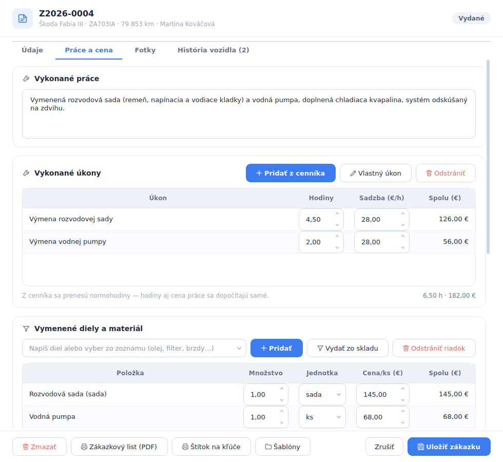
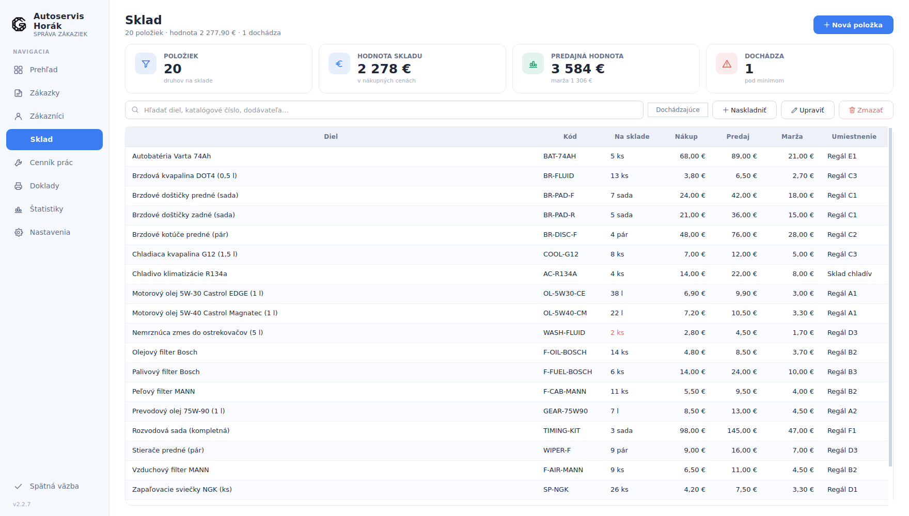
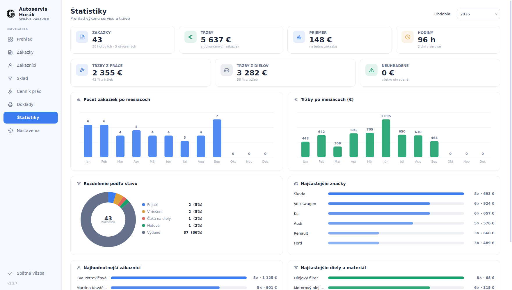

# GridServis

**Od príjmu auta po faktúru.**
Program na správu autoservisu pre Windows — a web, ktorý ho predáva.

---

## Čo to rieši

Malé a stredné autoservisy vedú zákazky v zošite, v Exceli alebo v esemeskách.
Keď sa po pol roku vráti to isté auto, nikto nevie, čo sa na ňom naposledy
robilo. Na konci mesiaca sa tržby dopočítavajú ručne.

**GridServis** to celé drží na jednom mieste. Zákazka obsahuje zákazníka, auto,
popis závady, vykonané úkony z cenníka prác, vymenené diely zo skladu, fotky aj
cenu. Z tej istej zákazky sa vytlačí zákazkový list, faktúra aj štítok na kľúče.

Program beží lokálne na počítači v dielni — **dáta zostávajú u dielne**, nie
v cudzom cloude. Na bežnú prácu so zákazkami netreba ani internet.

Projekt má dve časti: **program pre Windows**, ktorý používa dielňa, a **web**,
ktorý program predstavuje a predáva k nemu predplatné.

---

## Program

Sedem obrazoviek, ktoré pokrývajú bežný deň v dielni.

### Prehľad

Čísla za rok, rozrobené zákazky a posledný pohyb hneď po otvorení — bez
preklikávania sa kdekoľvek inam.

### Zákazky

Zoznam s filtrami podľa stavu (prijaté, v riešení, čaká na diely, hotové,
vydané) a vyhľadávaním podľa mena, značky, ŠPZ aj čísla zákazky. Číslovanie je
automatické v tvare `Z2026-0001`, farba stavu je vidieť na prvý pohľad.

### Detail zákazky

Úkony sa ťahajú z cenníka prác aj s normohodinami, diely zo skladu — cena práce
sa dopočíta zo sadzby dielne, takže sa nikde nesčítava ručne. Zo spodnej lišty
sa tlačí zákazkový list, faktúra aj štítok na kľúče.

### Sklad

Diely s katalógovým číslom, umiestnením v regáli, nákupnou a predajnou cenou aj
maržou. Program sám ukáže, čo kleslo pod minimum.

### Štatistiky

Tržby po mesiacoch, pomer práce a dielov, neuhradené, rozdelenie zákaziek podľa
stavu, najčastejšie značky vozidiel aj najhodnotnejší zákazníci.

Ďalej sú v programe **Zákazníci** (karty s autami, počtom zákaziek a útratou),
**Cenník prác** (úkony v kategóriách s normohodinami) a **Nastavenia** (údaje
dielne do hlavičky dokladov, hodinová sadzba, IBAN, splatnosť, DPH, číslovanie).

---

## Web

Prezentačný web v slovenčine: popis programu, cenník, časté otázky, návod na
inštaláciu a predaj predplatného.

| Domov | Cenník |
| --- | --- |
|  |  |

Zákazník si najprv stiahne demo zadarmo a vyskúša ho na vlastných zákazkách.
Keď mu program sadne, kúpi si predplatné — platbu vybavuje Stripe a licenčný
kód dostane hneď po zaplatení aj e-mailom.

Web je postavený tak, aby **nesťahoval nič z cudzích domén** — žiadne externé
písma, reklamné skripty ani vložený obsah. Návštevnosť sa meria vlastným
riešením, ktoré ukladá len typ udalosti a stránku: žiadne cookies, žiadne
sledovanie, žiadna IP adresa.

---

## Kontakt

support@gridservis.app

---

## Licencia

© 2026 DarkMaster9452. Všetky práva vyhradené. Kód je zverejnený len na
prezeranie — kopírovanie, úpravy ani použitie v inom projekte či na vlastný
prospech nie sú bez písomného súhlasu dovolené. Podrobnosti sú v súbore
[LICENSE](LICENSE).
